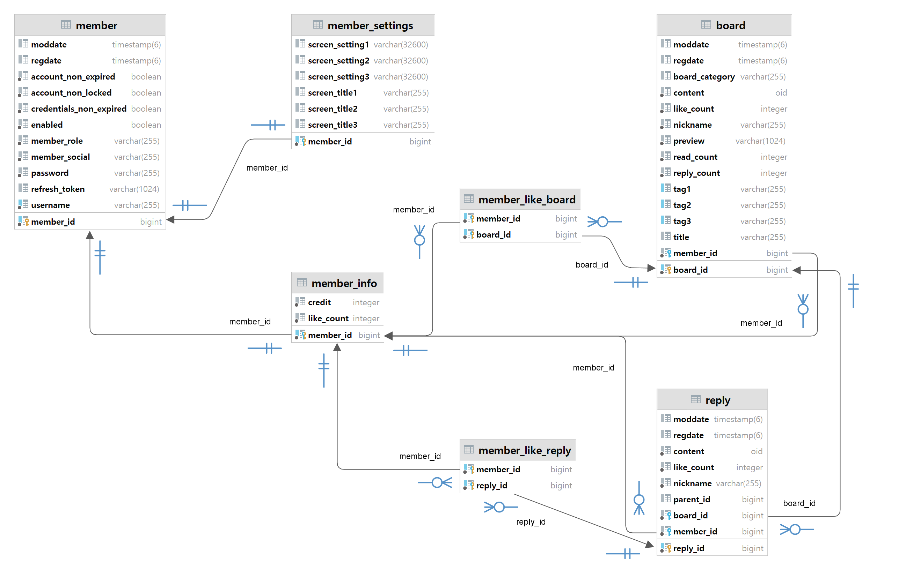

### 프로젝트 StockKid

**컨셉** : HTS (Home Trading System) 의 웹 버전 + 커뮤니티 + AI를 활용한 분석/자동매매 시스템

**개발자로서의 초기 목표** : 프론트엔드, 백엔드, 그리고 배포까지 경험하여 개발의 전반적인 과정에 대한 이해도를 높임으로써 향후 고급 개발 능력을 갖추기 위한 기반을 마련합니다.

**버전 관리** : Git, GitHub

**프론트엔드** : TypeScript, React, Tailwind CSS, daisyUI, i18next, React Router, Redux Toolkit, RTK Query, React-Grid-Layout, Remirror

https://github.com/r2d2-k3po/stockkid-fe

**백엔드** : Java, Spring Boot, Spring Data JPA, Spring Security, PostgreSQL

https://github.com/r2d2-k3po/stockkid-be

**배포** : AWS Route 53, Certificate Manager, S3, CloudFront, API Gateway, EC2, RDS

https://stockkid.net

------------------------------------------------------------------------------------------------------

**백엔드 주요 설계 포인트** : REST 방식의 api 로서 모든 경로는 인증 방식에 따라 다음의 7가지 경우로 나뉘며 인증이 필요없는 /permit/** 경로를 제외하면 각각 대응하는 security filter 를 거쳐야 합니다.

/permit/** : 인증이 필요없는 사용자명/비밀번호를 이용한 회원가입이나 각종 기본 정보를 얻어오기 위한 경로입니다.

/login : 사용자명/비밀번호를 이용한 로그인을 위한 경로이며 ApiLoginFilter 에서 인증 후 token 들을 발급합니다.

/google/**, /naver/**, /kakao/** : 소셜 로그인을 위한 경로이며 각각 ApiGoogleFilter, ApiNaverFilter, 또는 ApiKakaoFilter 에서 authorization code flow 에 따라 인증 후 token 들을 발급합니다.

/refresh/** : ApiRefreshFilter 에서 refresh token rotation 정책에 따라 token 들을 재발급하거나 로그아웃시 저장된 refresh token 을 삭제하기 위한 경로입니다.

/access/** : ApiAccessFilter 에서 header 에 담긴 access token 을 받아 인증 후 SecurityContext 에 사용자 정보를 저장하고 controller 단으로 요청을 넘깁니다.

Entity 들은 가능하면 불필요한 조인이 발생하지 않도록 테이블 구조와 연관 관계를 단순화하는 방식으로 설계하였습니다.

**Member** : 로그인 정보를 담고 있으며 access token 생성시 사용자 및 권한 확인을 위해 member_id 와 member_role 정보를 access token 에 담게 됩니다. /access/** 경로로 요청이 들어올 경우 access token 인증 후 token 에 담긴 member_id 와 member_role 정보를 SecurityContext 에 저장하고 이후 controller 또는 service 단에서 이 정보를 이용하여 요청을 처리하게 됩니다. 한편 여기서 member_role 의 경우 ADMIN > STAFF > USER 순의 RoleHierarchy 를 적용하였습니다.

**MemberSettings** : Member 와 일대일 식별관계로서 스크린 셋팅 등 각종 셋팅 정보를 담게 됩니다.

**MemberInfo** : Member 와 일대일 식별관계로서 각종 다양한 회원 정보를 담는데 사용합니다. 또한 Board, Reply 와 일대다 연관 관계를 맺고 있어 회원이 작성한 게시글들이나 댓글들을 찾는데 사용할 수 있습니다. 게시글과 댓글의 추천 시스템은 최초 1회만 적용되도록 하며, Board, Reply 와 다대다 연관 관계를 맺어 각각 자동으로 생성되는 member_like_board 와 member_like_reply 연결 테이블을 이용해 추천이 이미 이루어졌는지 판단하게 됩니다.

**Board** : 게시글의 정보를 담고 있으며 MemberInfo 와 다대일, Reply 와 일대다의 연관 관계를 맺고 있습니다. 댓글 작성 빈도수보다 게시글 목록 프리뷰 및 게시글 단순 조회의 빈도수가 훨씬 크다는 전제 하에, 조회시 집계 함수를 사용하여 매번 댓글 수를 계산하지 않고 반정규화하여 replyCount 필드를 두며, 댓글 작성시에 replyCount 를 갱신하게 됩니다.

**Reply** : 댓글의 정보를 담고 있으며 MemberInfo, Board 와 다대일의 연관 관계를 맺고 있습니다. parent_id 를 사용해 부모 댓글이 무엇인지 표시하며 null 일 경우 원 게시글이 부모임을 표시합니다.

------------------------------------------------------------------------------------------------------

# stockkid-be

project StockKid backend
